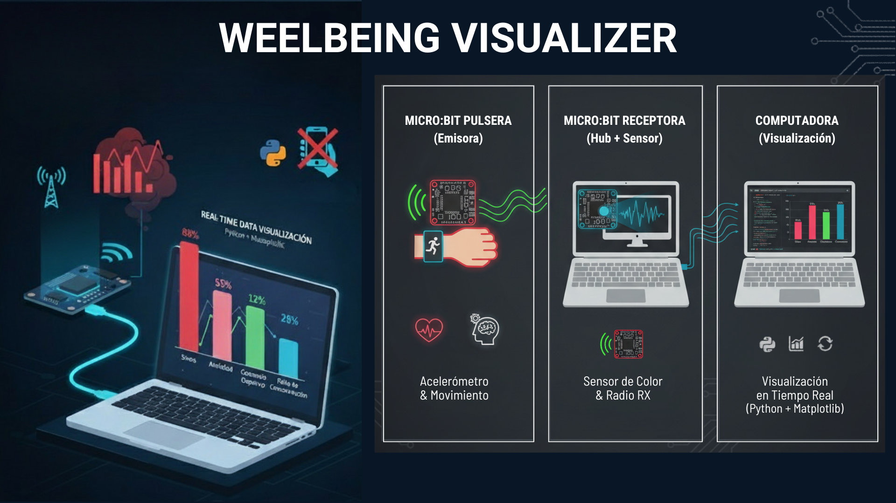

# **Interactive Wellbeing Reporter (IoT \+ Python Data Viz)**

## **Description**

This project is a real-time data visualization system that utilizes a distributed **Micro:bit** hardware architecture and asynchronous **Python** processing. The system monitors emotional wellbeing indicators (stress, anxiety, fatigue) based on two key factors: blue light exposure from screens and physical activity levels.

## **Project Architecture**

The system is divided into three main layers for a continuous Live Streaming data flow:

1. **Micro:bit Wristband (Transmitter):** Uses the accelerometer to detect movement and physical activity. It sends this data via radio frequency to the receiving Micro:bit.  
2. **Micro:bit Receiver (Hub \+ Sensor):** Permanently connected to the PC. It receives radio data from the wristband and uses an integrated color sensor to detect the blue light spectrum (representing screen exposure). It transmits the consolidated data via Serial (USB) to the computer.  
3. **Computer (Visualization):** Runs a Python script that processes the incoming data stream and generates an interactive dynamic chart.

## **Project Spirit**

The central objective is to promote **Digital Balance**. Through the visual metaphor of the bars, the user can observe how positive physical actions compensate for the exhaustion caused by technological overexposure, encouraging active awareness of mental health in the digital age.

## **Tech Stack**

* **Hardware:**  
  * 1x Micro:bit (Receiver Hub \+ Color Sensor).  
  * 1x Micro:bit (Wristband Transmitter \+ Accelerometer).  
* **Language:** Python 3.x.  
* **Communication:** Radio (inter-device) and Serial Protocol (PySerial for PC integration).  
* **Visualization:** Matplotlib for real-time dynamic animation.  
* **Data Management:** Threading & Queue architecture to ensure zero-latency UI updates.

## **Repository Files**

* /src/grafico\_dinamico.py: Main Python script for data processing and visualization.  
* /firmware/microbit-Feria-Ciencias-Gráfico.hex: Firmware for the receiver Micro:bit (Radio RX \+ Color Sensor).  
* /firmware/microbit-Pulsera-Actividad-Fisica.hex: Firmware for the transmitter Micro:bit (Accelerometer).  
* /assets/: High-resolution project images and banners.

## **Configuration & Installation**

1. **Flash Firmware:** Load the corresponding .hex files onto each Micro:bit.  
2. **Hardware Connection:** Connect the "Receiver" Micro:bit to your PC via USB.  
3. **Install Dependencies:**  
   pip install \-r requirements.txt

4. **Run Application:**  
   python src/grafico\_dinamico.py

## **Interaction & Logic**

* **Screen Exposure (Blue Spectrum):** Increases Stress, Anxiety, and Cognitive Fatigue levels (Pink/Red bars).  
* **Physical Activity (Movement):** Decreases impact levels, promoting recovery and focus (Blue/Green bars).  
* **Reset:** Press the a key on your keyboard to return all values to their initial baseline.

*Project developed for Science Fair \- IoT, Hardware, and Health Integration.*
